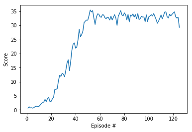

# Udacity DRL Navigation Project Report

### Algorithm Overview
The agent model is based on the Deep Deterministic Policy Gradients (DDPG) algorithm, which is based on the Actor-Critic networks. The Actor network is used to calculate the action based on the current state. The Critic network is used to predict the Q-value, i.e. the value of the current (state, action). The negative of the Q-value is used as a loss measure for training the Actor network. To measure the loss of the Critic network, a "true" or target Q-value is calculated using the Bellman equation, which in pseudocode looks like `Q_targets = rewards + gamma * critic_target(next_states, actions_next)`

The Actor network hyperparameters:
* Hidden layers: 2
* 1st hidden layer nodes (FC): 400
* 2nd hidden layer nodes (FC): 300
* Output layer nodes (actions): 4
* Input parameters (states): 33
* Activation function: ReLU (except output - tanh)

The Critic network hyperparameters:
* Hidden layers: 2
* 1st hidden layer nodes (FC): 400
* 2nd hidden layer nodes (FC): 300
* Output layer nodes (Q-value): 1
* Input parameters (states): 33
* Activation function: ReLU

### Training
The agent model was trained on AWS (P3.2xlarge).
The following hyperparameters were used:
* Optimizer: Adam
* Replay buffer size: 100000
* Minibatch size: 128
* Discount factor (Gamma): 0.99
* Learning rate (Actor): 0.0001
* Learning rate (Critic): 0.001
* L2 weight decay: 0

The agent was able to solve the environment (30+ scores) in 125 episodes within 32 minutes:

```
Episode 100	Average Score: 22.50	Score: 33.027
Episode 125	Average Score: 30.07	Score: 29.316
Environment solved in 125 episodes!	Average Score: 30.07
```



### Future Ideas
To improve the agent's performance the following techniques can be used:
 - reduce learning rates `LR_ACTOR` and `LR_CRITIC`
 - increase the `BATCH_SIZE`
 - increase number of neurons in Actor and Critic networks
 - compare with other algorithms (PPO, A3C, D4PG)
